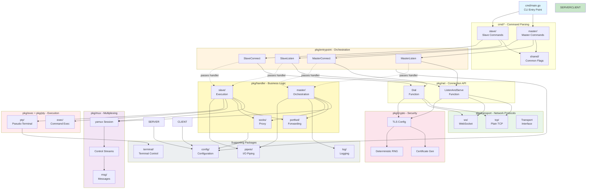

# Architecture

> Overview of **goncat** - a netcat-like tool for creating bind/reverse shells with an SSH-like experience. Last scanned: 2025-10-23, commit `51f9b8c`.

## Bird's-Eye View

**goncat** is a cross-platform CLI tool written in Go that provides netcat-like functionality with advanced features including encryption, authentication, and pseudo-terminal (PTY) support. The tool solves the problem of creating secure, interactive remote shells and tunnels without requiring SSH infrastructure.

**Core Capabilities:**
- **Dual-mode operation**: Master controls connection parameters; Slave executes instructions
- **Flexible topology**: Both master and slave can listen or connect (4 combinations: master-listen, master-connect, slave-listen, slave-connect)
- **Transport protocols**: TCP, WebSocket (ws), WebSocket Secure (wss)
- **Security**: TLS encryption with optional password-based mutual authentication
- **Interactive shells**: Cross-platform PTY support (Linux, Windows, macOS)
- **Tunneling**: Local/remote port forwarding with TCP and UDP protocol support, SOCKS5 proxy (TCP CONNECT, UDP ASSOCIATE)
- **Convenience**: Session logging and automatic cleanup capabilities

**Execution Flow:**

1. CLI parses commands (master/slave, listen/connect) → validates configuration
2. Entrypoint creates server (listen mode) or client (connect mode) with handler from `pkg/handler`
3. Server/Client chooses transport implementation (TCP or WebSocket) and optionally wraps in TLS
4. Handler receives connection, creates yamux session with control and data streams
5. Handler orchestrates (master) or executes (slave) based on control messages
6. Execution layer provides interactive shell or command execution with optional PTY
7. Port forwarding/SOCKS handlers tunnel additional connections as needed

**Architecture Stats:**
- 158 Go source files (~20k lines of code)
- 37 packages (10 cmd/, 27 pkg/)
- ~9-10MB statically-compiled binaries per platform
- Zero external runtime dependencies (CGO_ENABLED=0)

## Code Map

### `/cmd` - Command-Line Interface

Entry points and CLI command definitions using `urfave/cli/v3`:

- **`main.go`**: Application entry point, defines CLI app structure with master/slave/version subcommands
- **`master/`**: Master mode commands and flag definitions
  - Controls connection parameters (exec, pty, logging, forwarding)
  - Can listen for incoming slave connections or connect to slave listener
- **`slave/`**: Slave mode commands and flag definitions
  - Executes instructions from master
  - Can listen for incoming master connections or connect to master listener
- **`shared/`**: Common flags (protocol, host, port, ssl, key, timeout) and parser utilities
- **`version/`**: Version command implementation
- **`masterconnect/`, `masterlisten/`, `slaveconnect/`, `slavelisten/`**: Command handlers for the four operation modes

**Architectural Rule**: `cmd/` packages only parse CLI arguments and delegate to `pkg/entrypoint`, never implement business logic directly.

### `/pkg` - Core Functionality Packages

Organized into distinct layers and concerns:

#### Entry Points (`pkg/entrypoint`)
- **Purpose**: Top-level entry functions for the four operation modes
- **Files**: `masterconnect.go`, `masterlisten.go`, `slaveconnect.go`, `slavelisten.go`
- **Responsibility**: Create server/client instances and pass handlers to them
- **Pattern**: Accept `config.Shared` and `config.Master/Slave`, use `pkg/net` for connections with handlers from `pkg/handler`
- **Key insight**: Entrypoint does NOT directly use transport or mux - those are abstracted by pkg/net

#### Network Connection API (`pkg/net`)
- **Purpose**: Simplified abstraction layer between entrypoint and transport protocols
- **API**:
  - `Dial(ctx, cfg) (net.Conn, error)` - Establishes connection and returns it directly
  - `ListenAndServe(ctx, cfg, handler) error` - Creates listener and serves connections until done
- **Features**:
  - Chooses transport based on protocol (TCP vs WebSocket vs UDP)
  - Handles TLS encryption and mutual authentication if `--ssl` enabled
  - Manages connection lifecycle, timeouts, and cleanup internally
  - Clears deadlines after operations to prevent premature connection termination
- **Key insight**: pkg/net knows about `pkg/transport` and `pkg/crypto`, but entrypoint only needs the simple Dial/ListenAndServe API

#### Transport Layer (`pkg/transport`, `pkg/transport/tcp`, `pkg/transport/ws`, `pkg/transport/udp`)
- **Purpose**: Protocol abstraction for network connections
- **API Design**: Function-based (no interfaces, no structs to instantiate)
  - `Dial(ctx, addr, timeout, [deps]) (net.Conn, error)` - Establishes connections
  - `ListenAndServe(ctx, addr, timeout, handler, [deps]) error` - Serves connections, blocks until done
  - All functions handle timeout management, context cancellation, and cleanup internally
- **Implementations**: 
  - `tcp/`: Plain TCP connections with keep-alive enabled
    - `Dial()` and `ListenAndServe()` with dependency injection support
    - Listener uses semaphore (capacity 100) for connection limiting
    - Timeouts set before operations, cleared immediately after to prevent killing healthy connections
  - `ws/`: WebSocket connections using `github.com/coder/websocket`
    - Separate functions: `DialWS/DialWSS` and `ListenAndServeWS/ListenAndServeWSS`
    - Converts WebSocket to `net.Conn` via `websocket.NetConn()`
    - WSS uses transport-level TLS with ephemeral certificates
    - HTTP server-based, rejects additional connections with HTTP 503 when capacity reached
    - Listener uses semaphore (capacity 100) for connection limiting
  - `udp/`: QUIC connections using `github.com/quic-go/quic-go`
    - `Dial()` and `ListenAndServe()` for QUIC over UDP
    - Built-in TLS 1.3 at transport layer (QUIC requirement)
    - Init byte mechanism for stream activation (transparent to callers)
    - Listener uses semaphore (capacity 100) for connection limiting
- **Pattern**: All return `net.Conn` for uniform handling by higher layers
- **Timeout handling**: Explicit set-before-operation / clear-after-operation pattern throughout
- **Concurrency**: All listeners support up to 100 concurrent connections via semaphore

#### Security Layer (`pkg/crypto`)
- **Purpose**: TLS certificate generation and mutual authentication
- **Key files**:
  - `ca.go`: CA key pair and certificate generation using ECDSA P256
  - `cert.go`: Client certificate generation signed by CA
  - `crypto.go`: Main entry point `GenerateCertificates(seed)` returns CA pool and certificate
  - `random.go`: Deterministic RNG (`dRand`) using SHA-512 for password-based cert generation
- **Security model**: 
  - Ephemeral certificates per run (new key pair for each listen)
  - If seed (password) provided: deterministic certificate generation for mutual auth
  - Empty seed generates random certificates (encryption only, no auth)
  - CA certificate validity: 1970 to 2063 (effectively permanent)
- **Used by**: `pkg/net` wraps connections in `tls.Server()` or `tls.Client()` and uses custom certificate verifier
- **Special handling**: `dRand` works around Go's non-deterministic certificate generation for reproducible certs

#### Multiplexing Layer (`pkg/mux`)
- **Purpose**: Multiple logical streams over single connection using yamux
- **Implementation**: Wraps `github.com/hashicorp/yamux` with control stream management
- **Components**:
  - `session.go`: Base `Session` wrapper holding yamux session and control streams
  - `master.go`: `MasterSession` with gob encoder/decoder for master→slave communication
  - `slave.go`: `SlaveSession` with gob encoder/decoder for slave→master communication
  - `msg/`: Message type definitions for control protocol (Hello, Foreground, PortForward, SOCKS, etc.)
- **Control Streams**: Two dedicated channels established during session setup:
  - `ctlClientToServer`: Master sends commands (encoded with gob), slave receives
  - `ctlServerToClient`: Slave sends responses (encoded with gob), master receives
- **Data Streams**: Additional yamux streams opened on demand for:
  - Foreground shell I/O
  - Port forwarding connections
  - SOCKS proxy connections
- **Concurrency**: Uses `sync.Mutex` to ensure atomic send+open operations
- **Timeouts**: Configurable timeout for all operations (default from `config.Shared.Timeout`)
- **Used by**: `pkg/handler/master` calls `mux.OpenSessionContext()`, `pkg/handler/slave` calls `mux.AcceptSessionContext()`

#### Handler Layer (`pkg/handler`)
- **Purpose**: Master orchestration and slave execution logic
- **Structure**:
  - `master/`: Master-side handler coordinating operations
    - `master.go`: Main handler creates mux session, performs handshake, orchestrates tasks
    - `foreground.go`: Manages foreground shell/command execution
    - `portfwd.go`: Initiates port forwarding (local and remote)
    - `socks.go`: Sets up SOCKS proxy server
  - `slave/`: Slave-side handler responding to master commands
    - `slave.go`: Main handler accepts mux session, performs handshake, listens for commands
    - `foreground.go`: Executes commands or provides shell via exec/pty
    - `portfwd.go`: Handles port forwarding requests
    - `socks.go`: Handles SOCKS proxy connections
  - `portfwd/`: Shared port forwarding implementation
    - `server.go`: Accepts TCP or UDP connections and forwards through yamux streams
    - `client.go`: Receives yamux streams and connects to TCP or UDP targets
    - Supports protocol selection via prefix: `-L T:8080:target:80` (TCP), `-L U:53:dns:53` (UDP)
    - UDP implementation includes session tracking (client address → yamux stream mapping)
  - `socks/master/`: SOCKS5 proxy server on master side
  - `socks/slave/`: SOCKS5 proxy client on slave side (connects to actual targets)
- **Pattern**: 
  - Master creates `MasterSession`, sends control messages (gob-encoded)
  - Slave creates `SlaveSession`, receives control messages, executes actions
  - Both perform handshake by exchanging `msg.Hello` messages
  - Additional yamux streams opened for data transfer
- **Message Types**: `msg.Hello`, `msg.Foreground`, `msg.PortForward`, `msg.SOCKSConnect`, `msg.SOCKSAssociate`, `msg.SOCKSDatagram`
- **Concurrency**: Uses goroutines and `sync.WaitGroup` for concurrent operations

#### Execution Layer (`pkg/exec`, `pkg/pty`)
- **`exec/`**: Command execution with I/O piping
  - `exec.go`: Main `Run()` function - executes program and pipes I/O to net.Conn
  - `exec_default.go`: Unix implementation using `os/exec.Command`
  - `exec_windows.go`: Windows-specific implementation
  - Uses `pipeio.Pipe()` for bidirectional I/O between command and connection
  - Waits for both command exit AND I/O completion before returning
- **`pty/`**: Pseudo-terminal support for interactive shells
  - `pty.go`: Common interface and `TerminalSize` struct
  - `pty_unix.go`: Unix PTY allocation using `syscall` package
  - `pty_unix_linux.go`, `pty_unix_darwin.go`: Platform-specific PTY implementations
  - `pty_windows.go`: Windows ConPTY implementation using Windows console API
  - PTY provides interactive terminal with proper control sequences (colors, cursor movement, etc.)
- **Platform differences**:
  - Unix: Uses `syscall.ForkExec` with PTY file descriptor
  - Windows: Uses ConPTY API with complex handle juggling
  - Both expose same interface to handlers
- **Used by**: `pkg/handler/slave/foreground.go` calls either `exec.Run()` or platform-specific PTY code

#### Supporting Packages
- **`config/`**: Configuration structures and validation
  - `Shared`: Common config (protocol, host, port, SSL, key, timeout, dependencies)
  - `Master`: Master-specific config (exec, pty, log file, port forwarding, SOCKS)
  - `Slave`: Slave-specific config (cleanup flag)
  - Protocol constants: `ProtoTCP`, `ProtoWS`, `ProtoWSS`
  - `Dependencies`: Injectable dependencies for testing (network, stdio, exec functions)
  - `KeySalt`: Build-time injected random salt for key derivation
- **`log/`**: Colored console output and session logging
  - `ErrorMsg()`: Red text to stderr
  - `InfoMsg()`: Blue text to stderr
  - Uses `github.com/fatih/color` for colored output
- **`format/`**: Output formatting utilities (address formatting, etc.)
- **`terminal/`**: Terminal handling and PTY support
  - `Pipe()`: Bidirectional I/O between stdio and network connection
  - `PipeWithPTY()`: PTY-enabled piping with raw mode and terminal size sync
  - Uses `golang.org/x/term` for raw mode and terminal control
  - Sends terminal size updates via gob encoding
- **`pipeio/`**: Bidirectional I/O piping
  - `Pipe()`: Copies data bidirectionally between two `io.ReadWriteCloser`
  - Uses two goroutines for concurrent bidirectional copy
  - `sync.Once` for cleanup, captures first error only
  - Recognizes benign errors (EOF, EPIPE, ECONNRESET, closed connections)
  - `cmdio.go`: Merges stdout/stderr into single reader for command I/O
- **`clean/`**: Self-deletion cleanup
  - `EnsureDeletion()`: Sets up signal handlers to delete executable on exit
  - Platform-specific: Unix uses signals, Windows uses scheduled task
- **`socks/`**: SOCKS5 protocol constants and message parsing (RFC 1928)
  - Defines message structures for method selection, connect, UDP associate
  - Supports IPv4, IPv6, FQDN address types
  - Used by `pkg/handler/socks` packages

### `/mocks` - Test Infrastructure

Mock implementations for testing without real system resources:

- **`mockstdio.go`**: Mock stdin/stdout using pipes
  - `MockStdio` provides pipe-based stdin/stdout for testing
  - `WriteToStdin()` simulates user input
  - `ReadFromStdout()` retrieves application output
  - `WaitForOutput()` waits for expected strings with timeout
  - Uses `sync.Cond` for efficient output waiting
  
- **`mockexec.go`**: Mock command execution
  - Simulates `os/exec.Command` without spawning real processes
  - Returns configurable exit codes and output
  
- **`mockudp.go`**: Mock UDP network
  - Simulates UDP connections for SOCKS UDP ASSOCIATE testing
  
- **`tcp/network.go`**: Mock TCP network using `net.Pipe()`
  - `MockTCPNetwork` simulates TCP without real sockets
  - `ListenTCP()` and `DialTCP()` create in-memory connections
  - Listeners keyed by address string, uses `sync.Cond` for coordination
  - Connections use `net.Pipe()` for bidirectional in-memory I/O
  
- **Purpose**: Enable integration tests to run quickly and deterministically
- **Injection**: Via `config.Dependencies` (network, stdio, exec functions)
- **Pattern**: Mock implementations satisfy same interfaces as real ones

### `/test` - Test Suites

Three-tier testing strategy with different scopes and mocking approaches:

- **`test/integration/`**: High-level workflow tests using mocks from `mocks/` package
  - Tests complete master-slave interactions via entrypoint functions
  - Mocks injected via `config.Dependencies` (network, stdio, exec)
  - `plain/`: Basic master-slave communication and data exchange
  - `exec/`: Command execution workflows
  - `portfwd/`: Port forwarding scenarios (local and remote)
  - `socks/`: SOCKS proxy testing (connect/ and associate/ for TCP and UDP)
  - Fast execution (~1-2 seconds), deterministic results
  - Example: `plain/plain_test.go` tests end-to-end data flow with mock network
  
- **`test/e2e/`**: End-to-end tests with real compiled binaries
  - Docker containers (Alpine Linux) with `expect` scripts
  - Tests all transport protocols (tcp, ws, wss) in realistic scenarios
  - Two topologies: bind shell (slave-listen) and reverse shell (slave-connect)
  - No mocking - validates actual binary behavior
  - Slower execution (~8-9 minutes for full suite)
  - Docker Compose files: `docker-compose.slave-listen.yml`, `docker-compose.slave-connect.yml`
  
- **`test/helpers/`**: Shared test utilities
  - Helper functions for setting up test scenarios
  - Configuration builders for tests
  - Common test fixtures

**Note**: Unit tests (`*_test.go`) live alongside source code in package directories and use internal dependency injection with simple fakes.

## Architectural Invariants

### Layering Rules

1. **CLI → Entrypoint → Net → Transport/Crypto**: `cmd/` packages call `pkg/entrypoint`, which uses `pkg/net.Dial` or `pkg/net.ListenAndServe` and passes handlers from `pkg/handler`. pkg/net then chooses transport implementations from `pkg/transport` and handles TLS via `pkg/crypto`.

2. **No Reverse Dependencies**: Lower layers never depend on higher layers:
   - `pkg/transport` does not know about `pkg/net`
   - `pkg/net` does not know about `pkg/entrypoint`
   - `pkg/crypto` is used by `pkg/net`, not by entrypoint
   - `pkg/mux` is used by `pkg/handler`, not by entrypoint
   - `pkg/exec` and `pkg/pty` do not know about `pkg/handler`

3. **Interface Boundaries**: Side-effecting code (I/O, network, exec) is behind interfaces:
   - `transport.Dialer` and `transport.Listener` abstract protocols
   - `config.Dependencies` (network, stdio, exec) enable testability
   - Platform-specific code isolated in separate files (`_unix.go`, `_windows.go`)

4. **Stateless Components**: Most packages are stateless, state lives in:
   - `mux.Session` (yamux session + control streams)
   - Handler goroutines (short-lived per connection)
   - Configuration structs passed down from CLI

### Security Invariants

1. **TLS Required for Authentication**: `--key` flag requires `--ssl` (validated in `config.Shared.Validate()`)

2. **Ephemeral Certificates**: New TLS certificate generated per `listen` invocation

3. **No Plaintext Credentials**: Passwords combined with random KeySalt (injected at build time) for key derivation

4. **KeySalt Randomization**: Build injects unique 64-byte hex salt via ldflags for each binary compilation

### Concurrency Rules

1. **Goroutine Ownership**: Each connection handler spawns goroutines, responsible for cleanup

2. **Channel-Based Cancellation**: Use `context.Context` for graceful shutdown propagation

3. **WaitGroup Coordination**: `sync.WaitGroup` ensures goroutines complete before cleanup (see `pkg/pipeio`)

4. **Mutex Protection**: Shared state protected by `sync.Mutex` (rare, mostly in test fakes)

5. **Yamux Stream Timeout**: Default 75s `StreamOpenTimeout` in yamux config (session-level timeout)

## Boundaries & Integrations

### External Dependencies

**Direct dependencies** (from `go.mod`):
- `github.com/urfave/cli/v3` (v3.0.0-beta1) - CLI framework
- `github.com/coder/websocket` (v1.8.12) - WebSocket support
- `github.com/hashicorp/yamux` (v0.1.2) - Stream multiplexing
- `github.com/fatih/color` (v1.18.0) - Colored terminal output
- `github.com/muesli/cancelreader` (v0.2.2) - Cancelable stdin reader
- `golang.org/x/sys` (v0.31.0) - Low-level system calls (PTY, Windows console)
- `golang.org/x/term` (v0.30.0) - Terminal control (raw mode, size)

**Standard library** (key uses):
- `crypto/tls`, `crypto/x509` - TLS encryption and certificates
- `crypto/rand` - Secure random generation
- `net`, `net/http` - Networking primitives
- `os/exec` - Command execution
- `syscall` - Platform-specific system calls (PTY on Unix)
- `encoding/gob` - Control message serialization

### Configuration & Environment

**Configuration Sources:**
1. **CLI Flags**: Primary configuration mechanism (parsed by `urfave/cli`)
2. **Build-time Variables**: `KeySalt` and `Version` injected via ldflags
3. **No Config Files**: All configuration via command-line arguments

**Environment Integration:**
- `os.Stdin/Stdout/Stderr` - Interactive I/O (can be mocked via `config.Dependencies.Stdio`)
- `os.Getenv` - Not used; no environment variable configuration
- Filesystem - Session logs written when `--log` specified

### System Boundaries

**Network Boundary:**
- Inbound: `transport.Listener` accepts connections
- Outbound: `transport.Dialer` establishes connections
- Tunneling: Port forwarding and SOCKS proxy bridge network boundaries

**Process Boundary:**
- Slave executes commands via `pkg/exec` (spawns child processes)
- Master sends commands over control stream
- PTY provides interactive terminal to child process

**Filesystem Boundary:**
- Session logging (`--log` flag writes to file)
- Self-deletion (`--clean` flag removes binary)
- No persistent state or databases

## Cross-Cutting Concerns

### Logging

**Implementation**: `pkg/log` with colored output via `github.com/fatih/color`

**Levels**:
- `ErrorMsg()` - Red text to stderr (critical errors)
- `InfoMsg()` - Blue text to stderr (informational messages)
- **No verbose/debug levels** - all logging is unconditional

**Session Logging**: Separate feature (`--log` flag)
- Records all bytes on main data stream to file
- Implemented in `pkg/handler/master/foreground.go`
- Does not include control messages or metadata

### Error Handling

**Philosophy**: Errors propagate up the call stack; goroutines handle locally

**Patterns**:
1. **Explicit error returns**: All functions return `error` as last value
2. **Error wrapping**: Not used extensively; errors returned directly
3. **Fatal errors**: `log.ErrorMsg()` + program termination at CLI level
4. **Goroutine errors**: Logged locally but don't crash program

**Validation**: `config.Shared.Validate()` and `config.Master/Slave.Validate()` return `[]error`

### Concurrency

**Patterns**:
1. **Bidirectional piping**: `pkg/pipeio.Pipe()` spawns two goroutines for copy in each direction
2. **Connection handling**: Each handler spawns goroutines for forwarding, SOCKS, etc.
3. **Synchronization**: `sync.WaitGroup` for goroutine coordination
4. **Cancellation**: `sync.Once` for cleanup, `context.Context` for propagation
5. **No shared mutable state**: Configuration passed by value, streams not shared

**Example** (`pkg/pipeio/pipeio.go`):
- Two goroutines copy data bidirectionally between `net.Conn` instances
- `WaitGroup` ensures both complete before returning
- `sync.Once` ensures cleanup happens exactly once
- First error captured, others discarded

### Security

**Threat Model**: Assumes attacker can intercept network traffic but not compromise endpoints

**Security Features**:
1. **Encryption**: TLS 1.2+ with ephemeral RSA certificates
2. **Authentication**: Optional password-based mutual certificate validation
3. **No credential storage**: Passwords never written to disk
4. **Build-time salt**: Each binary has unique KeySalt to prevent rainbow tables

**Limitations**:
- Self-signed certificates (no PKI infrastructure)
- No certificate pinning (except with `--key` for mutual auth)
- Command execution on slave side is unlimited (trusted endpoints assumed)

### Testing & Quality

**Testing Strategy** (see `TESTING.md`):
1. **Unit tests**: Next to source code, use dependency injection
2. **Integration tests**: In `test/integration/`, use `mocks/` package
3. **E2E tests**: In `test/e2e/`, use Docker + real binaries

**Coverage**:
- Unit tests: `go test -cover ./pkg/...` (~5 seconds)
- Integration tests: `go test ./test/integration/...` (~1-2 seconds)
- E2E tests: Docker Compose scenarios (~8-9 minutes)
- **CI requires**: All tests pass with race detection (`-race` flag)

**Linting**:
- `go fmt` - formatting
- `go vet` - static analysis
- `staticcheck` - additional linting (installed automatically)

## Dependency & Data Flow

**Flow Description:**

1. **CLI Layer**: User invokes `goncat master|slave listen|connect` with flags
2. **Command Layer**: `cmd/` parses arguments into `config.Shared`, `config.Master/Slave`
3. **Entrypoint Layer**: `pkg/entrypoint` functions use `pkg/net.Dial` or `pkg/net.ListenAndServe`, pass handlers from `pkg/handler`
4. **Connection Layer**: `pkg/net` functions choose transport implementation (TCP/WebSocket/UDP) and handle TLS encryption via `pkg/crypto`
5. **Transport Layer**: Establish network connections using protocol-specific implementations
6. **Handler Layer**: Receive connections from pkg/net, create yamux sessions, orchestrate (master) or execute (slave)
7. **Multiplexing Layer**: Create control streams and data streams over single connection
8. **Execution Layer**: Slave spawns shell/command with optional PTY
9. **Supporting Layers**: Logging, I/O piping, terminal control throughout

**Data Flows:**

- **Main data stream**: User input ↔ PTY/exec ↔ yamux ↔ handler ↔ pkg/net ↔ TLS ↔ transport ↔ network
- **Control messages**: Master sends (exec, pty, forward configs) via `ctlClientToServer` stream
- **Status messages**: Slave sends (errors, confirmations) via `ctlServerToClient` stream
- **Port forwarding**: Additional yamux streams for each forwarded connection
- **SOCKS proxy**: Master accepts SOCKS connections, forwards via yamux streams to slave

## Testing & CI

### Test Organization

**Unit Tests** (`*_test.go` files):
- Location: Alongside source code in package directories
- Count: ~100+ test files
- Mocking: Internal dependency injection (e.g., `pkg/entrypoint` uses fake servers)
- Pattern: Table-driven tests with subtests
- Speed: ~5 seconds (full run), ~24 seconds (with race detection)

**Integration Tests** (`test/integration/`):
- Location: Separate test directory
- Categories:
  - `plain/` - Basic master-slave communication
  - `exec/` - Command execution workflows
  - `portfwd/` - Port forwarding scenarios
  - `socks/` - SOCKS proxy (connect, associate)
- Mocking: Uses `mocks/` package (MockTCPNetwork, MockStdio, MockExec)
- Speed: ~1-2 seconds (full run), ~4 seconds (with race detection)

**E2E Tests** (`test/e2e/`):
- Location: Separate test directory with Docker Compose files
- Scenarios: 6 scenarios (2 topologies × 3 protocols)
  - Bind shell (slave-listen): master-connect via tcp/ws/wss
  - Reverse shell (slave-connect): master-listen via tcp/ws/wss
- Implementation: Alpine Linux containers + expect scripts
- Speed: ~8-9 minutes (full run)

### CI Pipeline

**GitHub Actions** (`.github/workflows/test.yml`):
- Trigger: Push to `main`, all pull requests
- Environment: `ubuntu-latest` with Go 1.24
- Steps:
  1. Checkout repository
  2. Setup Go toolchain
  3. Run linters (`make lint`) - ~10 seconds
  4. Build all binaries (`make build`) - ~30-40 seconds
  5. Unit tests with race detection (`make test-unit-with-race`, 5 min timeout) - ~24 seconds
  6. Integration tests with race detection (`make test-integration-with-race`, 5 min timeout) - ~4 seconds
  7. E2E tests (`make test-e2e`, 10 min timeout) - ~8-9 minutes

**Total CI Time**: ~10-11 minutes per run

**Quality Gates**:
- All linters must pass (fmt, vet, staticcheck)
- All unit tests must pass with race detection
- All integration tests must pass with race detection
- All E2E scenarios must pass
- Binaries must build successfully for all platforms

### Coverage

**Coverage Measurement**: Unit and integration tests run with `-cover` flag

**Coverage Strategy**:
- Focus on behavior and edge cases, not just line coverage
- Critical paths: encryption, authentication, PTY, forwarding
- Error handling: timeout, connection failures, invalid input
- Platform-specific code: separate tests for Unix vs Windows

**No Coverage Target**: Project prioritizes meaningful tests over percentage goals

## Build & Distribution

### Build System

**Build Tool**: `make` with targets in `Makefile`

**Key Targets**:
- `make build` - Build all platforms (Linux, Windows, macOS)
- `make build-linux` - Linux binary (`dist/goncat.elf`)
- `make build-windows` - Windows binary (`dist/goncat.exe`)
- `make build-darwin` - macOS binary (`dist/goncat.macho`)
- `make lint` - Run all linters
- `make test` - Run all tests (unit + E2E)

**Build Configuration**:
- Static compilation: `CGO_ENABLED=0`
- Strip symbols: `-w -s` ldflags
- Reproducible: `-trimpath -buildid=`
- Injected variables:
  - `dominicbreuker/goncat/pkg/config.KeySalt` - Random 64-byte hex
  - `dominicbreuker/goncat/cmd/version.Version` - Version string (0.0.1)

**Build Output**:
- Directory: `dist/` (gitignored)
- Binary sizes: ~9-10MB each (statically linked)
- No external dependencies at runtime

### Distribution

**Current State**: Alpha - no official releases yet

**Planned**: GitHub Releases once interface stabilizes

**Installation**: Clone repository + `make build`

## Scope & Freshness

**Generated from commit** `51f9b8c` on `2025-10-23`.

**Repository**: [DominicBreuker/goncat](https://github.com/DominicBreuker/goncat)

**License**: GPL v3

**Status**: Alpha - work in progress, interface subject to change

**Maintenance**: This document should be regenerated when significant architectural changes occur, such as:
- New transport protocols added
- Major refactoring of handler or entrypoint layers
- Changes to master/slave communication protocol
- Addition of new major features (beyond port forwarding/SOCKS)

**Documentation**: For contributor guidelines and testing standards, see:
- `.github/copilot-instructions.md` - Comprehensive contributor guide
- `TESTING.md` - Testing strategy and patterns
- `README.md` - User-facing documentation and examples
