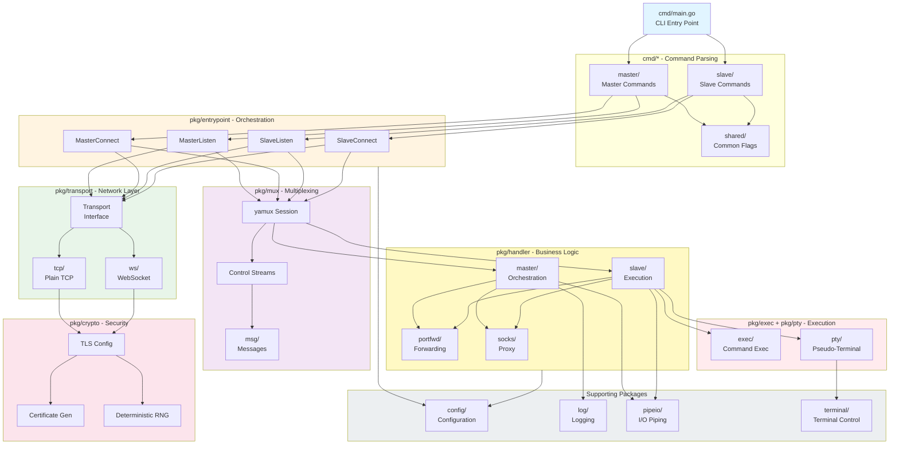

# Architecture

> Overview of **goncat** - a netcat-like tool for creating bind/reverse shells with an SSH-like experience. Last scanned: 2025-10-23, commit `51f9b8c`.

## Bird's-Eye View

**goncat** is a cross-platform CLI tool written in Go that provides netcat-like functionality with advanced features including encryption, authentication, and pseudo-terminal (PTY) support. The tool solves the problem of creating secure, interactive remote shells and tunnels without requiring SSH infrastructure.

**Core Capabilities:**
- **Dual-mode operation**: Master controls connection parameters; Slave executes instructions
- **Flexible topology**: Both master and slave can listen or connect (4 combinations: master-listen, master-connect, slave-listen, slave-connect)
- **Transport protocols**: TCP, WebSocket (ws), WebSocket Secure (wss)
- **Security**: TLS encryption with optional password-based mutual authentication
- **Interactive shells**: Cross-platform PTY support (Linux, Windows, macOS)
- **Tunneling**: Local/remote port forwarding and SOCKS5 proxy (TCP CONNECT, UDP ASSOCIATE)
- **Convenience**: Session logging and automatic cleanup capabilities

**Execution Flow:**

1. CLI parses commands (master/slave, listen/connect) → validates configuration
2. Transport layer establishes connection (TCP or WebSocket) → optional TLS wrapper
3. Multiplexing layer (yamux) creates control and data streams over single connection
4. Handler layer manages master orchestration or slave command execution
5. PTY/exec layer provides interactive shell or command execution
6. Port forwarding/SOCKS handlers tunnel additional connections as needed

**Architecture Stats:**
- 158 Go source files (~20k lines of code)
- 37 packages (10 cmd/, 27 pkg/)
- ~9-10MB statically-compiled binaries per platform
- Zero external runtime dependencies (CGO_ENABLED=0)

## Code Map

### `/cmd` - Command-Line Interface

Entry points and CLI command definitions using `urfave/cli/v3`:

- **`main.go`**: Application entry point, defines CLI app structure with master/slave/version subcommands
- **`master/`**: Master mode commands and flag definitions
  - Controls connection parameters (exec, pty, logging, forwarding)
  - Can listen for incoming slave connections or connect to slave listener
- **`slave/`**: Slave mode commands and flag definitions
  - Executes instructions from master
  - Can listen for incoming master connections or connect to master listener
- **`shared/`**: Common flags (protocol, host, port, ssl, key, timeout) and parser utilities
- **`version/`**: Version command implementation
- **`masterconnect/`, `masterlisten/`, `slaveconnect/`, `slavelisten/`**: Command handlers for the four operation modes

**Architectural Rule**: `cmd/` packages only parse CLI arguments and delegate to `pkg/entrypoint`, never implement business logic directly.

### `/pkg` - Core Functionality Packages

Organized into distinct layers and concerns:

#### Entry Points (`pkg/entrypoint`)
- **Purpose**: Top-level entry functions for the four operation modes
- **Files**: `masterconnect.go`, `masterlisten.go`, `slaveconnect.go`, `slavelisten.go`
- **Responsibility**: Orchestrate transport, crypto, mux, and handler layers
- **Pattern**: Accept `config.Shared` and `config.Master/Slave`, return errors

#### Transport Layer (`pkg/transport`, `pkg/transport/tcp`, `pkg/transport/ws`)
- **Purpose**: Protocol abstraction for network connections
- **Interface**: `Dialer` (establish outbound), `Listener` (accept inbound)
- **Implementations**: 
  - `tcp/`: Plain TCP using `net.Dial` and `net.Listen`
  - `ws/`: WebSocket using `github.com/coder/websocket`
- **Pattern**: Both return `net.Conn` for uniform handling

#### Security Layer (`pkg/crypto`)
- **Purpose**: TLS certificate generation and mutual authentication
- **Key files**:
  - `ca.go`: Certificate authority and certificate generation with password-based seeding
  - `random.go`: Deterministic RNG from password for mutual authentication
  - `crypto.go`: TLS config creation for client/server
- **Security model**: Ephemeral certificates per run, optional password-derived cert validation

#### Multiplexing Layer (`pkg/mux`)
- **Purpose**: Multiple logical streams over single connection
- **Implementation**: Wraps `github.com/hashicorp/yamux`
- **Streams**: Control streams (master→slave, slave→master) + data streams (shell, forwards)
- **Files**:
  - `master.go`, `slave.go`: Setup master/slave sessions
  - `session.go`: Session wrapper with control stream management
  - `msg/`: Control message definitions (gob encoding)

#### Handler Layer (`pkg/handler`)
- **Purpose**: Master orchestration and slave execution logic
- **Structure**:
  - `master/`: Coordinates shell, logging, port forwarding, SOCKS
  - `slave/`: Executes commands, provides PTY, handles forwarding
  - `portfwd/`: Port forwarding client/server implementations
  - `socks/`: SOCKS5 proxy implementation (TCP CONNECT, UDP ASSOCIATE)
- **Pattern**: Handlers accept yamux sessions and configuration, manage goroutines

#### Execution Layer (`pkg/exec`, `pkg/pty`)
- **`exec/`**: Command execution across platforms
  - `exec.go`: Common interface
  - `exec_default.go`: Unix implementation using `os/exec`
  - `exec_windows.go`: Windows-specific implementation
- **`pty/`**: Pseudo-terminal support
  - `pty.go`: Common interface
  - `pty_unix.go`, `pty_unix_linux.go`, `pty_unix_darwin.go`: Unix PTY implementations
  - `pty_windows.go`: Windows ConPTY implementation
  - **Platform quirks**: Windows requires special console API handling

#### Supporting Packages
- **`config/`**: Configuration structures (`Shared`, `Master`, `Slave`), protocol constants, validation
- **`client/`**, **`server/`**: Connection setup helpers
- **`log/`**: Colored console output (red errors, blue info) and session logging
- **`format/`**: Output formatting utilities
- **`terminal/`**: Terminal handling (raw mode, size detection)
- **`pipeio/`**: I/O piping utilities with bidirectional copy and cancellation
- **`clean/`**: Self-deletion cleanup (platform-specific)
- **`socks/`**: SOCKS protocol constants and message parsing

### `/mocks` - Test Infrastructure

Mock implementations for testing:
- **`mocktcp.go`**: Mock TCP network using `net.Pipe()` for testing without real sockets
- **`mockstdio.go`**: Mock stdin/stdout for testing I/O
- **Purpose**: Enable integration tests without real system resources

### `/test` - Test Suites

Three-tier testing strategy:

- **`test/integration/`**: High-level workflow tests using mocks
  - Tests complete master-slave interactions
  - Uses `mocks/` package and `config.Dependencies`
  - Categories: `exec/`, `plain/`, `portfwd/`, `socks/`
- **`test/e2e/`**: End-to-end tests with real binaries
  - Docker containers (Alpine Linux) with `expect` scripts
  - Tests all transport protocols (tcp, ws, wss)
  - Validates bind/reverse shell scenarios
- **`test/helpers/`**: Shared test utilities

**Note**: Unit tests (`*_test.go`) live alongside source code in package directories.

## Architectural Invariants

### Layering Rules

1. **CLI → Entrypoint → Components**: `cmd/` packages only parse arguments and call `pkg/entrypoint`, never directly use `pkg/transport`, `pkg/handler`, etc.

2. **No Reverse Dependencies**: Lower layers never depend on higher layers:
   - `pkg/transport` does not know about `pkg/handler`
   - `pkg/mux` does not know about `pkg/entrypoint`
   - `pkg/exec` and `pkg/pty` do not know about `pkg/handler`

3. **Interface Boundaries**: Side-effecting code (I/O, network, exec) is behind interfaces:
   - `transport.Dialer` and `transport.Listener` abstract protocols
   - `config.Dependencies` (network, stdio, exec) enable testability
   - Platform-specific code isolated in separate files (`_unix.go`, `_windows.go`)

4. **Stateless Components**: Most packages are stateless, state lives in:
   - `mux.Session` (yamux session + control streams)
   - Handler goroutines (short-lived per connection)
   - Configuration structs passed down from CLI

### Security Invariants

1. **TLS Required for Authentication**: `--key` flag requires `--ssl` (validated in `config.Shared.Validate()`)

2. **Ephemeral Certificates**: New TLS certificate generated per `listen` invocation

3. **No Plaintext Credentials**: Passwords combined with random KeySalt (injected at build time) for key derivation

4. **KeySalt Randomization**: Build injects unique 64-byte hex salt via ldflags for each binary compilation

### Concurrency Rules

1. **Goroutine Ownership**: Each connection handler spawns goroutines, responsible for cleanup

2. **Channel-Based Cancellation**: Use `context.Context` for graceful shutdown propagation

3. **WaitGroup Coordination**: `sync.WaitGroup` ensures goroutines complete before cleanup (see `pkg/pipeio`)

4. **Mutex Protection**: Shared state protected by `sync.Mutex` (rare, mostly in test fakes)

5. **Yamux Stream Timeout**: Default 75s `StreamOpenTimeout` in yamux config (session-level timeout)

## Boundaries & Integrations

### External Dependencies

**Direct dependencies** (from `go.mod`):
- `github.com/urfave/cli/v3` (v3.0.0-beta1) - CLI framework
- `github.com/coder/websocket` (v1.8.12) - WebSocket support
- `github.com/hashicorp/yamux` (v0.1.2) - Stream multiplexing
- `github.com/fatih/color` (v1.18.0) - Colored terminal output
- `github.com/muesli/cancelreader` (v0.2.2) - Cancelable stdin reader
- `golang.org/x/sys` (v0.31.0) - Low-level system calls (PTY, Windows console)
- `golang.org/x/term` (v0.30.0) - Terminal control (raw mode, size)

**Standard library** (key uses):
- `crypto/tls`, `crypto/x509` - TLS encryption and certificates
- `crypto/rand` - Secure random generation
- `net`, `net/http` - Networking primitives
- `os/exec` - Command execution
- `syscall` - Platform-specific system calls (PTY on Unix)
- `encoding/gob` - Control message serialization

### Configuration & Environment

**Configuration Sources:**
1. **CLI Flags**: Primary configuration mechanism (parsed by `urfave/cli`)
2. **Build-time Variables**: `KeySalt` and `Version` injected via ldflags
3. **No Config Files**: All configuration via command-line arguments

**Environment Integration:**
- `os.Stdin/Stdout/Stderr` - Interactive I/O (can be mocked via `config.Dependencies.Stdio`)
- `os.Getenv` - Not used; no environment variable configuration
- Filesystem - Session logs written when `--log` specified

### System Boundaries

**Network Boundary:**
- Inbound: `transport.Listener` accepts connections
- Outbound: `transport.Dialer` establishes connections
- Tunneling: Port forwarding and SOCKS proxy bridge network boundaries

**Process Boundary:**
- Slave executes commands via `pkg/exec` (spawns child processes)
- Master sends commands over control stream
- PTY provides interactive terminal to child process

**Filesystem Boundary:**
- Session logging (`--log` flag writes to file)
- Self-deletion (`--clean` flag removes binary)
- No persistent state or databases

## Cross-Cutting Concerns

### Logging

**Implementation**: `pkg/log` with colored output via `github.com/fatih/color`

**Levels**:
- `ErrorMsg()` - Red text to stderr (critical errors)
- `InfoMsg()` - Blue text to stderr (informational messages)
- **No verbose/debug levels** - all logging is unconditional

**Session Logging**: Separate feature (`--log` flag)
- Records all bytes on main data stream to file
- Implemented in `pkg/handler/master/foreground.go`
- Does not include control messages or metadata

### Error Handling

**Philosophy**: Errors propagate up the call stack; goroutines handle locally

**Patterns**:
1. **Explicit error returns**: All functions return `error` as last value
2. **Error wrapping**: Not used extensively; errors returned directly
3. **Fatal errors**: `log.ErrorMsg()` + program termination at CLI level
4. **Goroutine errors**: Logged locally but don't crash program

**Validation**: `config.Shared.Validate()` and `config.Master/Slave.Validate()` return `[]error`

### Concurrency

**Patterns**:
1. **Bidirectional piping**: `pkg/pipeio.Pipe()` spawns two goroutines for copy in each direction
2. **Connection handling**: Each handler spawns goroutines for forwarding, SOCKS, etc.
3. **Synchronization**: `sync.WaitGroup` for goroutine coordination
4. **Cancellation**: `sync.Once` for cleanup, `context.Context` for propagation
5. **No shared mutable state**: Configuration passed by value, streams not shared

**Example** (`pkg/pipeio/pipeio.go`):
- Two goroutines copy data bidirectionally between `net.Conn` instances
- `WaitGroup` ensures both complete before returning
- `sync.Once` ensures cleanup happens exactly once
- First error captured, others discarded

### Security

**Threat Model**: Assumes attacker can intercept network traffic but not compromise endpoints

**Security Features**:
1. **Encryption**: TLS 1.2+ with ephemeral RSA certificates
2. **Authentication**: Optional password-based mutual certificate validation
3. **No credential storage**: Passwords never written to disk
4. **Build-time salt**: Each binary has unique KeySalt to prevent rainbow tables

**Limitations**:
- Self-signed certificates (no PKI infrastructure)
- No certificate pinning (except with `--key` for mutual auth)
- Command execution on slave side is unlimited (trusted endpoints assumed)

### Testing & Quality

**Testing Strategy** (see `TESTING.md`):
1. **Unit tests**: Next to source code, use dependency injection
2. **Integration tests**: In `test/integration/`, use `mocks/` package
3. **E2E tests**: In `test/e2e/`, use Docker + real binaries

**Coverage**:
- Unit tests: `go test -cover ./pkg/...` (~5 seconds)
- Integration tests: `go test ./test/integration/...` (~1-2 seconds)
- E2E tests: Docker Compose scenarios (~8-9 minutes)
- **CI requires**: All tests pass with race detection (`-race` flag)

**Linting**:
- `go fmt` - formatting
- `go vet` - static analysis
- `staticcheck` - additional linting (installed automatically)

## Dependency & Data Flow

**Flow Description:**

1. **CLI Layer**: User invokes `goncat master|slave listen|connect` with flags
2. **Command Layer**: `cmd/` parses arguments into `config.Shared`, `config.Master/Slave`
3. **Entrypoint Layer**: `pkg/entrypoint` functions orchestrate connection setup
4. **Transport Layer**: Establishes network connection (TCP or WebSocket)
5. **Security Layer**: Wraps connection in TLS if `--ssl` specified
6. **Multiplexing Layer**: Creates yamux session with control streams
7. **Handler Layer**: Master orchestrates or slave executes based on control messages
8. **Execution Layer**: Slave spawns shell/command with optional PTY
9. **Supporting Layers**: Logging, I/O piping, terminal control throughout

**Data Flows:**

- **Main data stream**: User input ↔ PTY/exec ↔ yamux ↔ TLS ↔ transport ↔ network
- **Control messages**: Master sends (exec, pty, forward configs) via `ctlClientToServer` stream
- **Status messages**: Slave sends (errors, confirmations) via `ctlServerToClient` stream
- **Port forwarding**: Additional yamux streams for each forwarded connection
- **SOCKS proxy**: Master accepts SOCKS connections, forwards via yamux streams to slave

## Testing & CI

### Test Organization

**Unit Tests** (`*_test.go` files):
- Location: Alongside source code in package directories
- Count: ~100+ test files
- Mocking: Internal dependency injection (e.g., `pkg/entrypoint` uses fake servers)
- Pattern: Table-driven tests with subtests
- Speed: ~5 seconds (full run), ~24 seconds (with race detection)

**Integration Tests** (`test/integration/`):
- Location: Separate test directory
- Categories:
  - `plain/` - Basic master-slave communication
  - `exec/` - Command execution workflows
  - `portfwd/` - Port forwarding scenarios
  - `socks/` - SOCKS proxy (connect, associate)
- Mocking: Uses `mocks/` package (MockTCPNetwork, MockStdio, MockExec)
- Speed: ~1-2 seconds (full run), ~4 seconds (with race detection)

**E2E Tests** (`test/e2e/`):
- Location: Separate test directory with Docker Compose files
- Scenarios: 6 scenarios (2 topologies × 3 protocols)
  - Bind shell (slave-listen): master-connect via tcp/ws/wss
  - Reverse shell (slave-connect): master-listen via tcp/ws/wss
- Implementation: Alpine Linux containers + expect scripts
- Speed: ~8-9 minutes (full run)

### CI Pipeline

**GitHub Actions** (`.github/workflows/test.yml`):
- Trigger: Push to `main`, all pull requests
- Environment: `ubuntu-latest` with Go 1.24
- Steps:
  1. Checkout repository
  2. Setup Go toolchain
  3. Run linters (`make lint`) - ~10 seconds
  4. Build all binaries (`make build`) - ~30-40 seconds
  5. Unit tests with race detection (`make test-unit-with-race`, 5 min timeout) - ~24 seconds
  6. Integration tests with race detection (`make test-integration-with-race`, 5 min timeout) - ~4 seconds
  7. E2E tests (`make test-e2e`, 10 min timeout) - ~8-9 minutes

**Total CI Time**: ~10-11 minutes per run

**Quality Gates**:
- All linters must pass (fmt, vet, staticcheck)
- All unit tests must pass with race detection
- All integration tests must pass with race detection
- All E2E scenarios must pass
- Binaries must build successfully for all platforms

### Coverage

**Coverage Measurement**: Unit and integration tests run with `-cover` flag

**Coverage Strategy**:
- Focus on behavior and edge cases, not just line coverage
- Critical paths: encryption, authentication, PTY, forwarding
- Error handling: timeout, connection failures, invalid input
- Platform-specific code: separate tests for Unix vs Windows

**No Coverage Target**: Project prioritizes meaningful tests over percentage goals

## Build & Distribution

### Build System

**Build Tool**: `make` with targets in `Makefile`

**Key Targets**:
- `make build` - Build all platforms (Linux, Windows, macOS)
- `make build-linux` - Linux binary (`dist/goncat.elf`)
- `make build-windows` - Windows binary (`dist/goncat.exe`)
- `make build-darwin` - macOS binary (`dist/goncat.macho`)
- `make lint` - Run all linters
- `make test` - Run all tests (unit + E2E)

**Build Configuration**:
- Static compilation: `CGO_ENABLED=0`
- Strip symbols: `-w -s` ldflags
- Reproducible: `-trimpath -buildid=`
- Injected variables:
  - `dominicbreuker/goncat/pkg/config.KeySalt` - Random 64-byte hex
  - `dominicbreuker/goncat/cmd/version.Version` - Version string (0.0.1)

**Build Output**:
- Directory: `dist/` (gitignored)
- Binary sizes: ~9-10MB each (statically linked)
- No external dependencies at runtime

### Distribution

**Current State**: Alpha - no official releases yet

**Planned**: GitHub Releases once interface stabilizes

**Installation**: Clone repository + `make build`

## Scope & Freshness

**Generated from commit** `51f9b8c` on `2025-10-23`.

**Repository**: [DominicBreuker/goncat](https://github.com/DominicBreuker/goncat)

**License**: GPL v3

**Status**: Alpha - work in progress, interface subject to change

**Maintenance**: This document should be regenerated when significant architectural changes occur, such as:
- New transport protocols added
- Major refactoring of handler or entrypoint layers
- Changes to master/slave communication protocol
- Addition of new major features (beyond port forwarding/SOCKS)

**Documentation**: For contributor guidelines and testing standards, see:
- `.github/copilot-instructions.md` - Comprehensive contributor guide
- `TESTING.md` - Testing strategy and patterns
- `README.md` - User-facing documentation and examples
